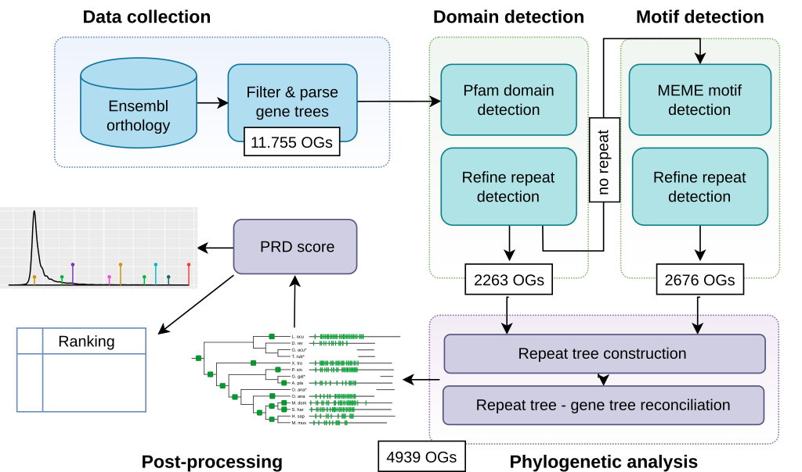

# PhyRepID pipeline

## Overview

The Phylogenomics Repeat Identification 
(PhyRepID) pipeline quantifies repeat evolution using comparative (phylo)genomics of orthologous groups (OGs). 

Preprint on bioRxiv: [doi.org/10.1101/2020.02.14.947036](https://doi.org/10.1101/2020.02.14.947036)

The pipeline consists of four components: 

 1. **Data collection:** Retrieval of protein sequences and gene trees from ENSEMBL from orthologous groups based  on a human protein-coding gene and its relation to 13 other selected representative vertebrate species.
 2. **Repeat detection & optimization:** Detection of a broad spectrum of protein repeats consisting of either structural domains or motif sequences. Followed by improving the sensitivity and precision of repeat detection by making OG-specific repeat models.
 3. **Phylogenetic tree reconciliation:** Inference of evolutionary events in the repeat region through phylogenetic comparison of repeat trees to gene trees.
 4. **Post-processing & duplication analysis:** Calculation of a protein repeat duplication (PRD) score for each OG as relative measure of repeat evolution. Next, a PRD score ranking  enables comparison of protein families to each other and find OGs with rapidly-evolving repeats. 
 

 
<b>PRD score = (x - u) / n;</b>

 with x = duplications since most recent common ancestor; u = mean duplications in the full dataset, n = number of proteins in the OG.

The workflow is defined in Snakemake.
Detailed documentation can be found in the docs

 - [Pipeline documentation](docs/pipeline_documentation.md)
 - [Additional analysis scripts documentation](docs/analysis_documentation.md)
 - [Supplementary table annotation](docs/supplement_documentation.md)

## Dependencies

### Python
Version 2.7 with pip (9.0.1)

 *pipeline\_methods.py* contains configuration like paths and environmental variables, as well as functions used by other Python scripts

**Data retrieval and processing**
 - SPARQLWrapper (1.8.1) 
 - requests (2.18.4) 
 - pandas (0.23.1) 
 - numpy (1.13.1)

**Tree reconciliation** 
 - anaconda-client (1.2.2)
 - conda (4.3.27) 
 - treefix (1.1.10) 
 - ete3 (3.0.0b36)

### Software

- HMMER3.1.b2 download and compile source code [http://hmmer.org/download.html  
](http://hmmer.org/download.html) BSD-3-Clause licensed. (Finn, Clements & Eddy, 2011)
 
- Pfam-A 31.0 models [ftp://ftp.ebi.ac.uk/pub/databases/Pfam/releases/Pfam31.0/](ftp://ftp.ebi.ac.uk/pub/databases/Pfam/releases/Pfam31.0/)
CC0 licensed. (Finn, R.D. et al., 2015)

-   MAFFT L-INS-I (Katoh, K., 2005)

 -   IQ-TREE  (Nguyen, L.-T. et al., 2014) with UBoot ultrafast bootstrapping (Hoang, D.T. et al., 2018) and ModelFinder (Kalyaanamoorthy, S. et al., 2017)

-   Species tree manually constructed based on the ENSEMBL species tree (Zerbino et al. 2018) annotated with taxonomic identifiers for the nodes and divergence times as branch lengths with the help of TimeTree.org (Hedges et al. 2015)

-   TreeFix (Wu, et al., 2013)
 
-   ETE toolkit ( Huerta-Cepas, et al. 2016)

### Input data:  

- Orthologous proteins were acquired from ENSEMBL Compara v91 (Zerbino et al. 2018) using a SPARQL query on the EBI endpoint (https://www.ebi.ac.uk/rdf/services/sparql) on 12-04-2018. Protein-coding genes homologous in *Homo sapiens* (http://identifiers.org/taxonomy/9606) and 13 [vertebrate species (settings)](pipeline/ensembl_stable_id_species.json) 
*Mus musculus* (mouse), *Monodelphis domestica* (opossum), *Sarcophilus harrisii* (tasmanian devil), *Ornithorhynchus anatinus* (platypus), *Anas platyrhynchos* (duck), *Gallus gallus* (chicken), *Gasterosteus aculeatus* (stickleback), *Takifugu rubripes* (takifugu), *Pelodiscus sinensis* (turtle), *Anolis carolinensis* (anole lizard), *Xenopus tropicalis* (frog), *Danio rerio* (zebrafish), *Lepisosteus oculatus* (spotted gar).
   
- The gene trees and protein sequences were retrieved via the ENSEMBL API ([http://rest.ensembl.org](http://rest.ensembl.org))
  
- The HGNC gene symbols were retrieved from ENSEMBL BioMart on 30-09-2018 from Human genes GRCh38.p12 (ENSEMBL release 93).
 
- Selectome: A list of human genes under positive selection as measured by dN/dS since the divergence of vertebrates was acquired from Sebastien Moretti on 04-09-2018 (Moretti et al., 2014.)

- ExAC database v0.3.1: Z-scores for synonymous, non-synonymous and loss-of-function mutations were acquired for each human gene, as well as the probability of being intolerant for loss-of-function mutations (Karczewski et al., 2016)
 

## References

  -   Finn, R.D. et al., 2015. The Pfam protein families database: towards a more sustainablefuture. Nucleic acids research, 44(D1), pp.D279–D285.
    
-   Hedges, S.B. et al., 2015. Tree of life reveals clock-like speciation and diversification. Molecular biology and evolution, 32(4), pp.835–845.
    
-   Hoang, D.T. et al., 2018. UFBoot2: Improving the Ultrafast Bootstrap Approximation. Molecular biology and evolution, 35(2), pp.518–522.
    
-   Huerta-Cepas, J., Serra, F. & Bork, P., 2016. ETE 3: Reconstruction, Analysis, and Visualization of Phylogenomic Data. Molecular biology and evolution, 33(6), pp.1635–1638.
    
-   Kalyaanamoorthy, S. et al., 2017. ModelFinder: fast model selection for accurate phylogenetic estimates. Nature methods, 14(6), pp.587–589.
    
-   Karczewski, K.J. et al., 2016. The ExAC Browser: Displaying reference data information from over 60,000 exomes. Available at: http://dx.doi.org/10.1101/070581.
    
-   Katoh, K., 2005. MAFFT version 5: improvement in accuracy of multiple sequence alignment. Nucleic acids research, 33(2), pp.511–518
    
-   Moretti, S. et al., 2014. Selectome update: quality control and computational improvements to a database of positive selection. Nucleic acids research, 42(Database issue), pp.D917–21.
    
-   Nguyen, L.-T. et al., 2014. IQ-TREE: A Fast and Effective Stochastic Algorithm for Estimating Maximum-Likelihood Phylogenies. Molecular biology and evolution, 32(1), pp.268–274.
    
-   Wu, Y.-C. et al., 2013. TreeFix: statistically informed gene tree error correction using species trees. Systematic biology, 62(1), pp.110–120.
    
-   Zerbino, D.R. et al., 2018. Ensembl 2018. Nucleic acids research, 46(D1), pp.D754–D761.
